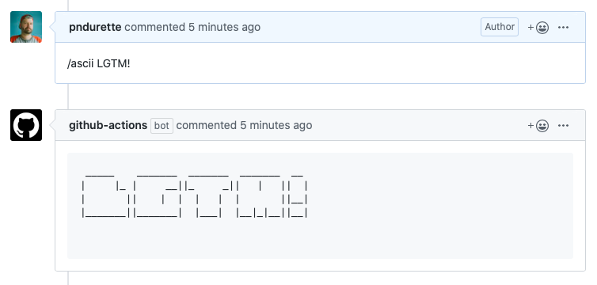

# ASCII reply (`pndurette/ascii-reply`)

Action that responds to an issue/PR comment, with that comment in ASCII art text.

Can be restricted to a 'command' (e.g. `/ascii <text>`).

It uses the Python [`art` library](https://github.com/sepandhaghighi/art) to generate ASCII text, using a [random medium font](https://github.com/sepandhaghighi/art#4-random-medium).



## Events

### `issue_comment` 

Tested with `types`: `created`

## Inputs

### `repo-token`

**Required** Token for the repo. Set literally to `${{ secrets.GITHUB_TOKEN }}`. No default.

## Outputs

None

## Example usage

```yaml
- uses: pndurette/ascii-reply@v2
  if: startsWith(github.event.comment.body, '/ascii')
  with:
    repo-token: ${{ secrets.GITHUB_TOKEN }}
```
